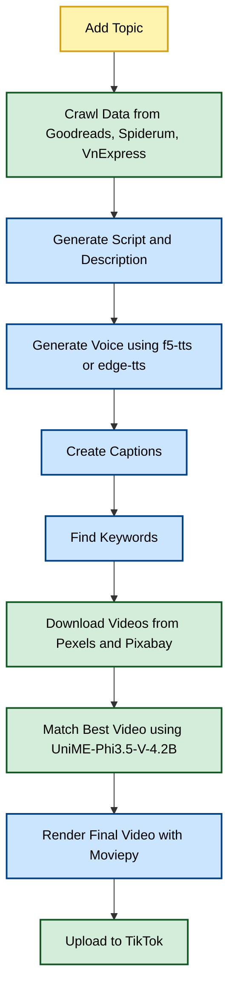

# Text-to-Video AI 🚀


[](https://github.com/mrzaizai2k/auto_tiktok)
[](https://opensource.org/licenses/MIT)
[](https://github.com/mrzaizai2k/auto_tiktok/releases)

Convert text to tiktok video using AI - **Mrzaizai2k's way**.  
Inspired by [SamurAIGPT/Text-To-Video-AI](https://github.com/SamurAIGPT/Text-To-Video-AI).

---

## 📑 Table of Contents
- [Mermaid Diagram](#mermaid-diagram)
- [Setup Instructions](#setup-instructions)
- [Video Generation Flow](#video-generation-flow)

---

## Mermaid Diagram



## Setup Instructions

1. **Create a `.env` file:**
```bash
OPENAI_API_KEY=your_openai_key
PEXELS_API_KEY=your_pexels_key
PIXABAY_API_KEY=your_pixabay_key
````

2. **Set up environment:**

Install necessary packages:

```bash
sudo apt update
sudo apt install -y make build-essential
sudo apt install ffmpeg
make install
```

Then create and activate conda environment:

```bash
conda create -n text2vid python=3.10 -y
conda activate text2vid
pip install -r requirements.txt
```

For TikTok upload:

```bash
cd src/tiktok_uploader/tiktok-signature
npm install
npx playwright install chromium
cd ../../
```

3. **Run the app:**

* Change topic in `src/app.py`
* Update configs in `config/config.yaml`

Run with:

```bash
python src/app.py
```

or

```bash
make run
```

👉 Output will be saved to:
`output/rendered_video.mp4` (based on `config/config.yaml`).

---

## Video Generation Flow

1. **Add Topic**

   * Crawl data from: [Goodreads](https://www.goodreads.com/), [Spiderum](https://spiderum.com/), [VnExpress](https://vnexpress.net/)
   * Generate script (`src/script/script_generator.py`)
   * Generate video description

2. **Generate Human Voice**

   * Use [f5-tts](https://huggingface.co/spaces/hynt/F5-TTS-Vietnamese-100h) model
   * Fallback: [edge-tts](https://pypi.org/project/edge-tts/)
   * Module: `src/audio_generator.py`

3. **Create Captions**

   * Extract voice + generate captions with [Whisper](https://github.com/openai/whisper)
   * Map script to captions for best Vietnamese accuracy

4. **Find Keywords for Background Videos**

   * Module: `src/video/video_search_query_generator.py`

5. **Download Background Videos**

   * Sources: [Pexels](https://www.pexels.com/), [Pixabay](https://pixabay.com/)
   * Match video with script using image-text similarity: [DeepGlint-AI/UniME-Phi3.5-V-4.2B](https://huggingface.co/DeepGlint-AI/UniME-Phi3.5-V-4.2B)

6. **Render Final Video**

   * Use [Moviepy](https://pypi.org/project/moviepy/)

7. **Upload Video to TikTok**

   * Install [J2TEAM cookies extension](https://microsoftedge.microsoft.com/addons/detail/j2team-cookies/lmakhegealefmkbnagibiebebncemhgn?hl=en-US)
   * Export TikTok cookies as `.json`
   * Place in `cookies/` folder
   * Update config: `tiktok_uploader['cookies_file']` in `config/config.yaml`

---


