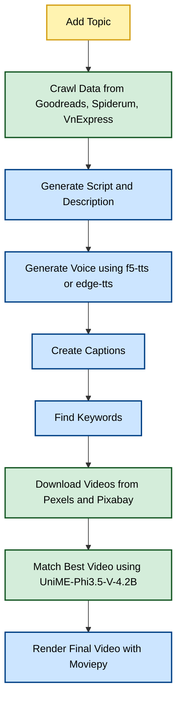

# Text-to-Video AI 🚀


[](https://github.com/mrzaizai2k/auto_tiktok)
[](https://opensource.org/licenses/MIT)
[](https://github.com/mrzaizai2k/auto_tiktok/releases)


Convert text to video using AI - Mrzaizai2k's way

Inspired by [SamurAIGPT/Text-To-Video-AI](https://github.com/SamurAIGPT/Text-To-Video-AI).


## Setup Instructions

1. Create a `.env` file:
```
    OPENAI_API_KEY=your_openai_key
    PEXELS_API_KEY=your_pexels_key
    PIXABAY_API_KEY=your_pixabay_key
```

2. Set up environment:

Set up neccesary packages
```
    sudo apt update
    sudo apt install -y make build-essential
    sudo apt install ffmpeg
    make install

```

Then set up environment

```
conda create -n text2vid python=3.10 -y
conda activate text2vid
pip install -r requirements.txt
```

3. Run the app:

First change topic in `src/app.py`

```
    python src/app.py
```
or
```
    make run
```

Output will be saved to `output/rendered_video.mp4` based on `config/config.yaml`.

## Video Generation Flow

1. **Add Topic**

   * Crawl data from:

     * [Goodreads](https://www.goodreads.com/)
     * [Spiderum](https://spiderum.com/)
     * [VnExpress](https://vnexpress.net/)
   * Generate script (`src/script/script_generator.py`)
   * Generate video description

2. **Generate Human Voice**

   * Use [f5-tts](https://huggingface.co/spaces/hynt/F5-TTS-Vietnamese-100h) model
   * Fallback to [edge-tts](https://pypi.org/project/edge-tts/)
   * Module: `src/audio_generator.py`

3. **Create Captions**

   * Extract voice and generate captions (`src/captions/timed_captions_generator.py`) using [Whisper](https://github.com/openai/whisper) model
   * Map script to captions for best Vietnamese accuracy

4. **Find Keywords for Background Videos**

   * Use `src/video/video_search_query_generator.py`

5. **Download Background Videos**

   * Sources:

     * [Pexels](https://www.pexels.com/)
     * [Pixabay](https://pixabay.com/)

    * Match Best Video with Script

        * Use image-text similarity: [DeepGlint-AI/UniME-Phi3.5-V-4.2B](https://huggingface.co/DeepGlint-AI/UniME-Phi3.5-V-4.2B)

7. **Render Final Video**

   * Use [Moviepy](https://pypi.org/project/moviepy/)


### Mermaid Diagram




## Troubleshooting

**Error**:
```
OSError: MoviePy Error: creation of None failed because of the following error:
convert-im6.q16: attempt to perform an operation not allowed by the security policy...
```

**Solution**:
ImageMagick's security policy is blocking the operation. Modify the policy file:

1. Open `/etc/ImageMagick-6/policy.xml`:
```
sudo nano /etc/ImageMagick-6/policy.xml
```
2. Find and comment out:
```
<!-- <policy domain="path" rights="none" pattern="@*"/> -->
```
3. Save, exit, and restart the app.

reference: https://www.youtube.com/watch?v=T8P9Cw1m9Z0

